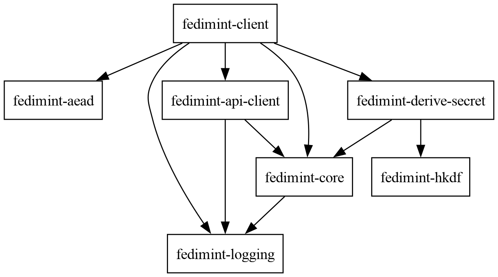

About Fedimint
===

* Federated E-Cash Mint 
* More generally: Module based system for building federated applications.

<!-- end_slide -->

Resources
===

* Github page: <https://github.com/fedimint/fedimint>
* Fedimint Reference Technical Documentation: <https://docs.fedimint.org>
* Discord Dev Chat: <https://discord.com/invite/Jq5dE2NhEd>

<!-- pause -->

Look up `CodeReferences` from this presentation in the Reference Documentation!

<!-- end_slide -->

Top-level architecture
===

* Client-Server architecture with multiple servers (consensus *Peer*s)
* Peers run *AlephBFT* consensus
* Clients communicate with peers in parallel to interact with the Federation
  * Usually but not always: require `T` of `M` matching responses (`QueryStrategy`)

<!-- end_slide -->

`fedimintd` architecture (threads)
===

Main threads (`tokio` tasks):

* API Server
* Consensus
* Per-Peer networking

Communication between tasks through the database and in-memory channels.

<!-- end_slide -->

`fedimintd` architecture (database)
===

* `rocksdb` used on both server and client
* snapshot level isolation
* rich Rust wrapper logic around raw functionality: `Database`

<!-- end_slide -->

`fedimintd` architecture (consensus)
===

* Fedimint consensus - like having own Federated blockchain
* AlephBFT ("atomic broadcast"): reliably orders `ConsensusItem`s:
  * `Transaction` (bunch of `DynInput`s and `DynOutput`s with a signature)
  * `DynModuleConsensusItem` - module specific 
  * other (extensible, e.g. consensus version voting, etc.)
* `ConsensusItem`s bundled in [`SessionOutcome`s]
* Redundant and robust by construction

<!-- pause -->

AlephBFT: <https://github.com/aleph-zero-foundation/AlephBFT>

<!-- end_slide -->

`fedimintd` architecture (consensus encoding)
===

* fork of `rust-bitcoin`'s `Encodable`
* schema-less, compact binary encoding
* supports module-extensible decoding via `Decoder`s in `ModuleDecoderRegistry`
* `derive` proc-macros 

<!-- end_slide -->

Fedimint Modules
===

* Federation = lightweight *core* + set of supported server side *modules* (`ModuleInitRegistry`)
* Modules have 2 sides: `ClientModule` and `ServerModule` (with some common shared types)
* `ClientModuleInit` and `ServerModuleInit` - "constructors"
* Has own Tx Inputs/Outputs, Consensus Items, APIs endpoints, versioning
* Standard modules:
  * *mint* - ECash
  * *wallet* - on-chain multisig
  * *ln* and *lnv2* - Fedimint LN Gateway contracts
  * *meta* - metadata consensus module
* `ModuleKind` (like Unix binary/cmd) vs `ModuleInstanceId` (like Unix PID)
  * supported kinds added at compile-time
  * instance composition set during DKG (in the future: allow changing the composition on a running mint)
* module `Dyn`-types (e.g. `DynInput`, `DynModuleConsensusItem`)

<!-- end_slide -->

`fedimint-client` architecture (state machines)
===

* client = client *core* + set of supported client side *modules* (`ClientModuleInitRegistry`)
* all client interactions modeled as persistent state machines
* idempotent steps
* event log
* *state machine executor* polling all state machines to completion

<!-- end_slide -->

Code overview: `fedimint-server` ("`fedimintd` without modules")
===

<!-- end_slide -->

Code overview: fedimintd ("`fedimintd` without modules")
===

<!-- end_slide -->

Code overview: `fedimint-client` (FDK?, "client lib without modules")
===

<!-- end_slide -->

Code overview: `fedimint-cli` (command line app)
===

